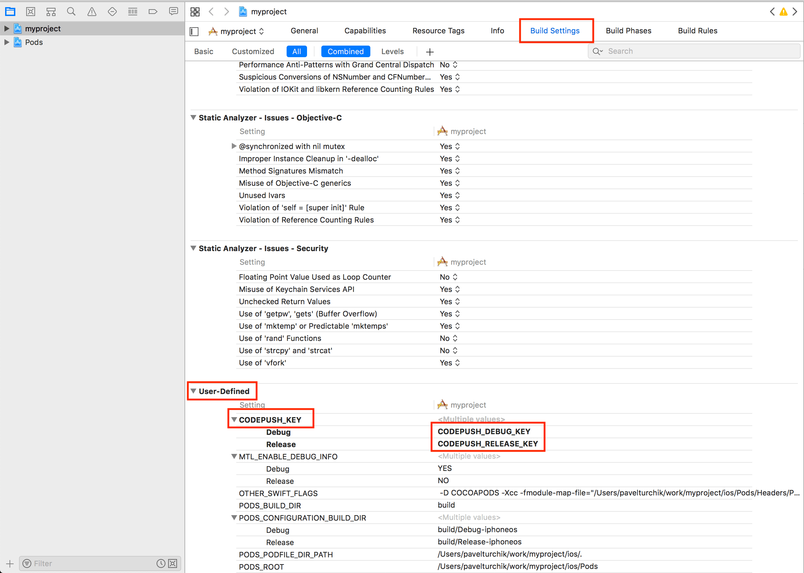

# StartupJS
:fire: React (Native + Web) starter kit and realtime model synchronization engine for Node.js with ORM (full-stack framework).

## Intro
This boilerplate launches with a [React web app](https://reactjs.org/) and [React Native app](https://facebook.github.io/react-native/) and allows to use a single code for all platforms.

The project is super helpful to kick-start your next project, as it provides a lot of the common tools you may reach for, all ready to go. Specifically:

- [React Router](https://reacttraining.com/react-router/) for routing and navigation with ability to separate project to [multi apps](https://github.com/dmapper/startupjs/blob/master/packages/app)
- [Model](https://github.com/dmapper/startupjs/blob/master/packages/react-sharedb) using [Racer and ShareDB](https://derbyjs.com/docs/derby-0.10/models) for working with local data stored in memory and remote data synced via ShareDB (in our case, [MongoDB](https://docs.mongodb.com/manual/installation/)).
- [ORM](https://github.com/dmapper/startupjs/blob/master/packages/orm) system for Racer and ShareDB
- [CodePush](https://github.com/Microsoft/react-native-code-push) for dynamic updates React Native apps
- [Node.js](https://nodejs.org/) as engine
- [Express](https://expressjs.com/) as web server
- [MongoDB](https://docs.mongodb.com/manual/installation/) as database
- [Redis](https://redis.io/) as pub/sub adapter for [Racer](https://github.com/derbyjs/racer)
- Code Quality
  - [Flow] (https://flow.org/en/docs/react/)
  - [ESLint] (https://eslint.org/)

## Requirements

- [Node](https://nodejs.org/) >= 12.0
- [Yarn](https://yarnpkg.com/)
- [MongoDB](https://docs.mongodb.com/manual/installation/) 4.0
- [Redis](https://redis.io/) 5.0
- [Xcode](https://developer.apple.com/xcode/) for iOS Development
- [Android SDK](https://developer.android.com/sdk/) for Android development

**OR**  

- [Docker](https://docs.docker.com/install/) (See [Docker development](#docker-development) section for details)

## Quick start

1. Initialize a new boilerplate project. Change `myapp` to your project name (use lower case)

```
npx startupjs init myapp --version=latest && cd myapp
```

2. Start **server** (in a separate terminal tab)

```
yarn server
```

3. Start **web** (in a separate terminal tab). Open `http://localhost:3000`

```
yarn web
```

4. Start **metro**, if you want to develop native iOS or Android apps (in a separate terminal tab)

```
yarn metro
```

5. Run **android** (in a separate terminal tab)

```
yarn android
```

6. Run **ios** (in a separate terminal tab)

```
yarn ios
```

## Docker development

Alternatively you can run a docker development image which has node, yarn, mongo and redis already built in.
You only need `docker` for this. And it works everywhere -- Windows, MacOS, Linux.

Keep in mind though that since docker uses its own driver to mount folders,
performance (especially when installing modules) might be considerably slower compared
to the native installation when working with the large amount of files.

1. Initialize a new project (change `awesomeapp` at the end to your app name):

```
docker run --rm -it -v ${PWD}:/ws:delegated startupjs/dev init awesomeapp
```

2. Go into the created project folder. Then run the development docker container with:

```
./docker
```

3. While inside the running container, start your app with:

```
yarn start
```

Open `http://localhost:3000` and you should see your app.

4. You can quickly exec into the running container from another terminal window using:

```
./docker exec
```

## Packages configuration
To get this project running with all dependencies, follow steps given below:

### CodePush
[CodePush](https://github.com/Microsoft/react-native-code-push) is a cloud service that enables React Native developers to deploy mobile app updates instantly to their user's devices. Following steps will help in configuring CodePush for project.
1. Install CodePush CLI
  ```
  npm install -g code-push-cli
  ```
2. Create/Login a CodePush account
  ```
  // Register
  code-push register

  // Login if registered already
  code-push login
  ```
3. Register your app
  ```
  // For Android
  code-push app add <App-Name-Android> android react-native

  // For iOS
  code-push app add <App-Name-Ios> ios react-native
  ```

**For Android**

1. Add empty `reactNativeCodePush_androidDeploymentKey` string item to `/path_to_your_app/android/app/src/main/res/values/strings.xml`. It may looks like this:

```xml
<resources>
  <string name="reactNativeCodePush_androidDeploymentKey" moduleConfig="true"></string>
  <string name="app_name">Lingua.Live</string>
</resources>
```

2. Get keys using `code-push deployment ls <App-Name-Android> --displayKeys` and copy both Debug and Release key in `/path_to_your_app/android/app/build.gradle`


3. Go to `/path_to_your_app/android/app/src/main/java/com/lingua/MainApplication.java` and add code which set keys. It may looks like this:

```java
@Override
protected List<ReactPackage> getPackages() {
  @SuppressWarnings("UnnecessaryLocalVariable")
  List<ReactPackage> packages = new PackageList(this).getPackages();
  // Set CodePush deployment keys here, because
  // we can't set different keys for debug and
  // release on strings.xml (reactNativeCodePush_androidDeploymentKey)
  for(ReactPackage reactPackage: packages) {
    if (reactPackage instanceof CodePush) {
      ((CodePush)reactPackage).setDeploymentKey(BuildConfig.CODEPUSH_KEY);
    }
  }
  return packages;
}
```

**For iOS**

1. Add `CodePushDeploymentKey` string item with value `$(CODEPUSH_KEY)` to `/path_to_your_app/ios/your_app/Info.plist`. It may looks like this:

```xml
<plist version="1.0">
<dict>
<!-- ...other configs... -->
<key>CFBundleVersion</key>
<string>1</string>
<key>CodePushDeploymentKey</key>
<string>$(CODEPUSH_KEY)</string>
<key>LSRequiresIPhoneOS</key>
<!-- ...other configs... -->
</dict>
</plist>
```

2. Get keys using code-push deployment ls <App-Name-Ios> --displayKeys then open `/path_to_your_app/ios` using `Xcode` and copy both Debug and Release key in



## Packages

- [App](https://github.com/dmapper/startupjs/blob/master/packages/app)

- [Backend](https://github.com/dmapper/startupjs/blob/master/packages/backend)

- [Bundler](https://github.com/dmapper/startupjs/blob/master/packages/bundler)

- [CLI](https://github.com/dmapper/startupjs/blob/master/packages/cli)

- [Cron](https://github.com/dmapper/startupjs/blob/master/packages/cron)

- [Init](https://github.com/dmapper/startupjs/blob/master/packages/init)

- [Model](https://github.com/dmapper/startupjs/blob/master/packages/model)

- [Offline](https://github.com/dmapper/startupjs/blob/master/packages/offline)

- [ORM](https://github.com/dmapper/startupjs/blob/master/packages/orm)

- [React sharedb](https://github.com/dmapper/startupjs/blob/master/packages/react-sharedb)

- [Routes middleware](https://github.com/dmapper/startupjs/blob/master/packages/routes-middleware)

- [Server](https://github.com/dmapper/startupjs/blob/master/packages/server)

## Troubleshooting

If you have any problem, search for the issues in this repository. If you don't find anything, you can raise an issue [here](https://github.com/dmapper/startupjs/issues).

## References

- [Generating keystores](https://coderwall.com/p/r09hoq/android-generate-release-debug-keystores)
- [CodePush](http://microsoft.github.io/code-push/docs/cli.html)
- [Checklist for deploying app](https://medium.com/the-react-native-log/checklist-to-deploy-react-native-to-production-47157f8f85ed)

## Licence

(MIT)
