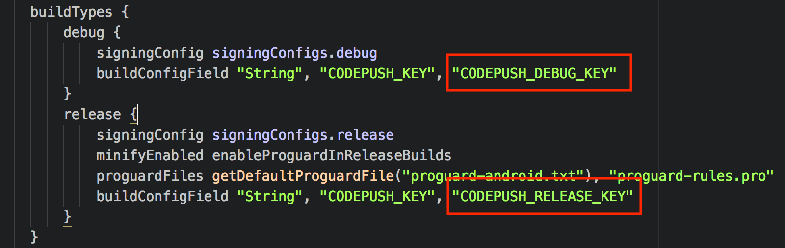

# startupjs codepush
> Dynamically push JS-only updates to the React Native apps

## Installation

```sh
yarn add @startupjs/codepush
```

## Requirements

```
react: *
react-native-code-push: >= 5.7.0 < 6
```

## Setup

[CodePush](https://github.com/Microsoft/react-native-code-push) is a cloud service that enables React Native developers to deploy mobile app updates instantly to all the devices of users.

Do the following steps to configure it for your project:

1. Install CodePush CLI
  ```
  npm install -g code-push-cli
  ```
2. Create/Login a CodePush account
  ```
  // Register
  code-push register

  // Login if registered already
  code-push login
  ```
3. Register your app
  ```
  // For Android
  code-push app add <App-Name-Android> android react-native

  // For iOS
  code-push app add <App-Name-Ios> ios react-native
  ```

### Android

1. Add empty `reactNativeCodePush_androidDeploymentKey` string item to `/path_to_your_app/android/app/src/main/res/values/strings.xml`. It should look similar to the following:

```xml
<resources>
  <string name="reactNativeCodePush_androidDeploymentKey" moduleConfig="true"></string>
  <string name="app_name">MyCoolApp</string>
</resources>
```

2. Get keys using `code-push deployment ls <App-Name-Android> --displayKeys` and copy both Debug and Release key in `/path_to_your_app/android/app/build.gradle`



3. Go to `/path_to_your_app/android/app/src/main/java/com/lingua/MainApplication.java` and add code which set keys. It should look similar to this:

```java
@Override
protected List<ReactPackage> getPackages() {
  @SuppressWarnings("UnnecessaryLocalVariable")
  List<ReactPackage> packages = new PackageList(this).getPackages();
  // Set CodePush deployment keys here, because
  // we can't set different keys for debug and
  // release on strings.xml (reactNativeCodePush_androidDeploymentKey)
  for(ReactPackage reactPackage: packages) {
    if (reactPackage instanceof CodePush) {
      ((CodePush)reactPackage).setDeploymentKey(BuildConfig.CODEPUSH_KEY);
    }
  }
  return packages;
}
```

### iOS

1. Add `CodePushDeploymentKey` string item with value `$(CODEPUSH_KEY)` to `/path_to_your_app/ios/your_app/Info.plist`. It may looks like this:

```xml
<plist version="1.0">
<dict>
<!-- ...other configs... -->
<key>CFBundleVersion</key>
<string>1</string>
<key>CodePushDeploymentKey</key>
<string>$(CODEPUSH_KEY)</string>
<key>LSRequiresIPhoneOS</key>
<!-- ...other configs... -->
</dict>
</plist>
```

2. Get keys using code-push deployment ls <App-Name-Ios> --displayKeys then open `/path_to_your_app/ios` using `Xcode` and copy both Debug and Release key in


## Usage

```js
import App from './App'
import codepush from '@startupjs/codepush'
export default codepush(App)
```

## How to publish new version with CodePush

By default the releases are non-critical. Which means that the update will be pushed to the application whenever the user opens it or goes back into it from the sleep mode.

In case your change is critical and requires force update, you can specify the `--mandatory` or `-m` flag. This way the application will be blocked by a popup even if the user is currently actively using the app. And the only way for user to continue will be to accept the popup dialog asking to update and restart the app.

```
appcenter codepush release-react -a ownerName/appName -d Production --description "Some description" --mandatory (optional)
```

**IMPORTANT (iOS)**: By default codepush using default plist file located at `ios/%PROJECT%/Info.plist`. If your file have another location or name you can specify plist file in command above by adding `--plist-file path/to/Info.plist`.

## References

- [Generating keystores](https://coderwall.com/p/r09hoq/android-generate-release-debug-keystores)
- [CodePush](http://microsoft.github.io/code-push/docs/cli.html)
- [Checklist for deploying app](https://medium.com/the-react-native-log/checklist-to-deploy-react-native-to-production-47157f8f85ed)
